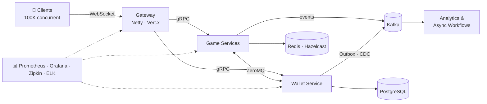

<picture>
  <source media="(prefers-color-scheme: dark)" srcset="assets/banner-dark.svg">
  <source media="(prefers-color-scheme: light)" srcset="assets/banner-light.svg">
  
</picture>

<div align="center">

[](https://www.linkedin.com/in/javidan-alizada-284781153/)
[](mailto:javidanalizada99@gmail.com)

</div>

<table align="center">
  <tr>
    <td align="center" width="150"><h2>300×</h2><sub>platform scalability</sub></td>
    <td align="center" width="150"><h2>100K</h2><sub>concurrent clients</sub></td>
    <td align="center" width="150"><h2>~85%</h2><sub>faster troubleshooting</sub></td>
    <td align="center" width="150"><h2>~150%</h2><sub>performance gain</sub></td>
    <td align="center" width="150"><h2>8+</h2><sub>years in production</sub></td>
  </tr>
</table>

## 👨‍💻 About Me

```java
public record Engineer(String name, String role, int yearsOfExperience,
                       List<String> domains, List<String> focus, String exploring) {}

var javidan = new Engineer(
    "Javidan Alizada",
    "Senior Software Engineer",
    8,
    List.of("iGaming", "FinTech", "Banking", "GovTech"),
    List.of("distributed systems", "high concurrency", "low latency",
            "event-driven architecture", "observability"),
    "Java 25 · virtual threads · structured concurrency"
);
```

I build backend platforms for real-money, real-time workloads, where **correctness under load**, **predictable latency** and **operability** matter as much as features.

## ⚡ Highlights

- 🚀 Led the re-architecture of a real-time game platform → **300× scalability, 100,000 concurrent clients**
- 🔭 Observability across JVM, gRPC, ZeroMQ & infra → **~85% faster troubleshooting**
- 📨 Event-driven architecture: **Kafka & RabbitMQ pipelines**, Outbox, CDC, Saga, delivery semantics & backpressure
- ⚙️ JVM performance: **concurrency, lock-free algorithms**, GC tuning, reactive programming (WebFlux)
- 🔍 Data & search: **Elasticsearch** indexing/query tuning, PostgreSQL & MongoDB optimization, Redis/Hazelcast caching

## 🏗️ How I Design Real-Time Platforms



<sub>Reference architecture: horizontally scalable stateless gateways, low-latency service-to-service messaging, transactional event publishing, and end-to-end observability.</sub>

## 🧰 Tech Stack

**Languages & Core**
<br />  

**Backend & Frameworks**
<br />     

**Messaging & Streaming**
<br />  

**Data & Storage**
<br />     

**Cloud, DevOps & Observability**
<br />      

**Architecture**
<br />      

## 📌 Featured Work

| Project | What it shows |
|---|---|
| 🔒 [**concurrent-collections-lock-free**](https://github.com/JavidanAlizada/concurrent-collections-lock-free) | Lock-free data structures on `VarHandle`: CAS algorithms & Java Memory Model reasoning |
| 🚦 [**resilience-traffic-control**](https://github.com/JavidanAlizada/resilience-traffic-control) | Rate limiting (GCRA, token bucket), timer wheel, retries with jitter, circuit breakers from first principles |
| 🎰 [**matrix-betting-game**](https://github.com/JavidanAlizada/matrix-betting-game) | Real-time betting game engine: probability-based symbol matrix, win combinations, bonus multipliers |
| 📁 [**reactive-file-storage**](https://github.com/JavidanAlizada/reactive-file-storage) | Non-blocking file storage service: Spring WebFlux, reactive MongoDB & Redis, JWT security, OpenAPI, Docker |

## 🧭 Journey

| Period | Domain | Focus |
|---|---|---|
| **2024 – now** | 🎰 iGaming | Real-time game platforms, 100K-client scale, gRPC/ZeroMQ, observability |
| **2023 – 2024** | 🏦 Banking | Risk & compliance services, Elasticsearch search, reactive APIs |
| **2021 – 2023** | 🏛️ GovTech | National e-government platform, team leadership, performance (+150%) |
| **2018 – 2021** | 💳 FinTech | Financial decision engine, event-driven microservices on Kafka |

<details>
<summary><b>🧠 Engineering principles I work by</b></summary>
<br />

- **Measure before optimizing.** Profiles, traces and load tests over intuition.
- **Design for failure.** Timeouts, retries with jitter, circuit breakers and bulkheads by default.
- **Make it observable.** If it isn't in a metric, a trace or a log, it doesn't exist in production.
- **Own it end to end.** From design doc to deployment to on-call.
- **Clear contracts.** Versioned APIs and explicit delivery semantics between services.
- **Simple beats clever,** unless the latency budget says otherwise.

</details>

## ✍️ Writing

<!-- Add article links here as you publish them -->
- *Coming soon:* Building a lock-free MPSC queue on VarHandle

---

<div align="center">

**Let's talk about distributed systems, concurrency or real-time platforms.**

[](https://www.linkedin.com/in/javidan-alizada-284781153/)
[](mailto:javidanalizada99@gmail.com)
[](https://github.com/JavidanAlizada)

</div>
